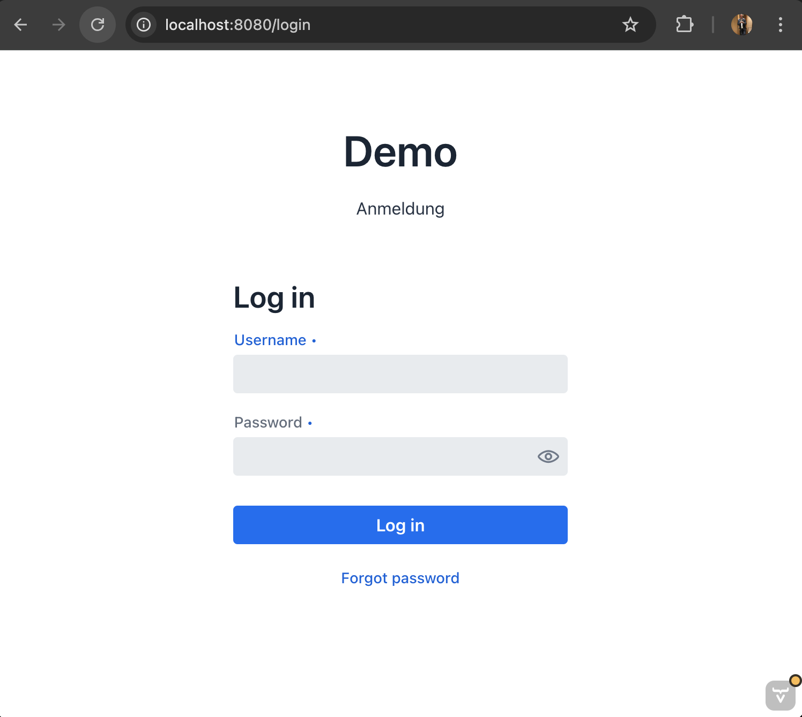
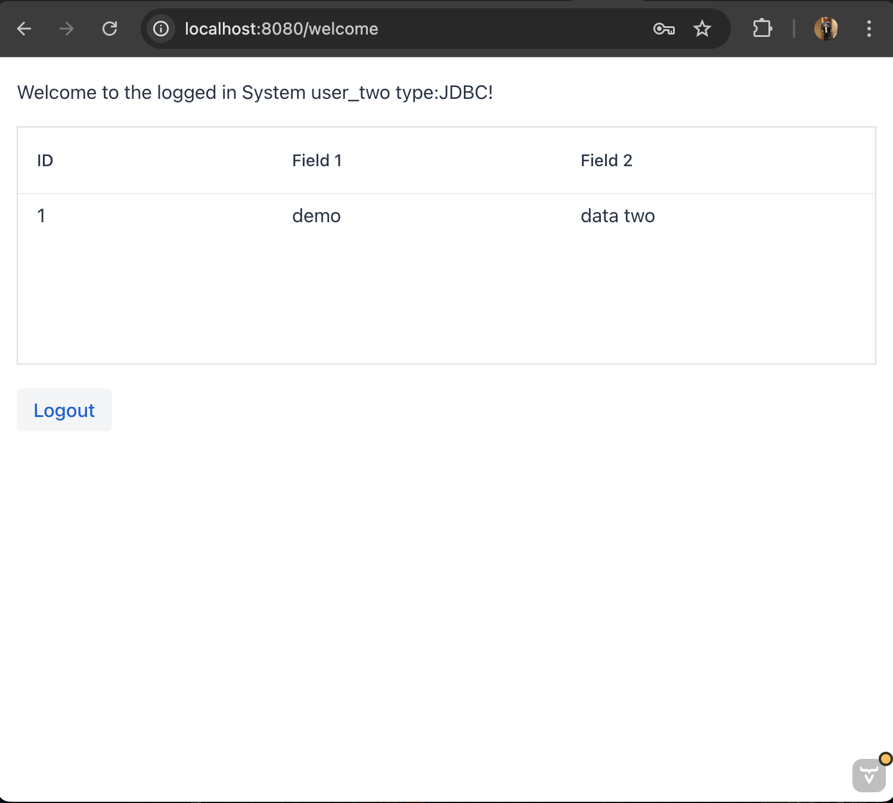

# Extended Multi Data Source Demo using JDBC or JPA (Profiles) with Vaadin Flow

(the more simple demo without using vaadin: https://github.com/andrlange/mds-test)

This Demo shows how we can use Spring Security with Database Users only and Multi-Schema in a DB for authentication and 
routing all 
DB Queries (CrudRepository or JPARepository + Service) using the right DB user context and the Option of JDBC only 
or JPA as you need.
It also demonstrates how to build your own login Page using Vaadin Flow and a login interceptor to use the 
Username/Password authentication of the given DB.

## using PostgreSQL 17 and PG Admin 4 (Docker-Compose)

All relevant data and configs from PostgreSQL and PGAdmin are exposed to the local File System ```/vols```

### Based on Spring Boot 3.3.5 / Vaadin Flow 24.5.3

- Spring Boot Starter JDBC
- Spring Boot Starter JPA
- Spring Boot Starter Security
- Spring Boot Starter Actuators
- PostgreSQL
- Lombok
- Spring Boot Starter Web

### Start docker instances:

```bash
# this will create a new folder vols to expose all PostgreSQL and Admin data
#
# init-database.sh and serevrs.json are mapped to the containers localfs
docker compose up -d
```

For PostgreSQL three users are created using three schemas:
- user_one : Password: password_one Schema: schema_user_one
- user_two : Password: password_two Schema: schema_user_two
- user_three : Password: password_three Schema: schema_user_three


all schemas have the same table: demo_data
 demo_data:
- id
- field1
- field2

Data:
- in schema_one -> 1,"demo","data one"
- in schema_two -> 1,"demo","data two"
- in schema_three -> 1,"demo","data three"


### running the service 
Depending of what you want to use, you need to give a profile "jdbc" or "jpa" to run the demo:

running jdbc
```bash
mvn spring-boot:run -Dspring-boot.run.profiles=jdbc
```

running jpa
```bash
mvn spring-boot:run -Dspring-boot.run.profiles=jpa
```

## Testing

Check which profile is used by:
```bash
curl -u user_one:password_one http://localhost:8080/demo
```
Returns: Hello user_one from authenticated user type:JDBC! OR Hello user_one from authenticated user type:JPA!


### Get Data
```bash
curl -u user_one:password_one http://localhost:8080/demo/data
```
returns: [{"id":1,"field1":"jdbc","field2":"data one"}]

```bash
curl -u user_two:password_two http://localhost:8080/demo/data
```
returns: [{"id":1,"field1":"jdbc","field2":"data two"}]

```bash
curl -u user_three:password_three http://localhost:8080/demo/data
```
returns: [{"id":1,"field1":"jdbc","field2":"data three"}]

### Statistics using actuators
This demo exposes some statistics about each DataSource [key,lastAccess,accessCount,secondsIdle]

The security configurations allows access to all actuator endpoints. To access the routing data sources endpoint use:
```http request
http://localhost:8080/actuator/routing-data-sources
```
Example Result:
```json
{
  "statistics": [
    {
      "key": "user_one",
      "accessCount": 4,
      "lastAccess": "2024-11-10 09:18:31",
      "secondsIdle": 59
    },
    {
      "key": "user_three",
      "accessCount": 1,
      "lastAccess": "2024-11-10 09:19:29",
      "secondsIdle": 1
    },
    {
      "key": "user_two",
      "accessCount": 4,
      "lastAccess": "2024-11-10 09:19:21",
      "secondsIdle": 9
    }
  ]
}
```

### Change Password
```bash
curl -u user_three:password_three -X POST http://localhost:8080/demo/change-password \
-H "Content-Type: application/json" \
-d '{"oldPassword": "password_three", "newPassword": "newSecret"}'
```
returns: true if it changed, else false


### Logout and Remove DataSource and close connections to DB
After some seconds the DataSource (HikariDataSource) will remove all it's connection from the Hikari Pool and close 
finally the connection to the DB.
```bash
curl -u user_three:password_three http://localhost:8080/demo/logout
```

## Explanation:

### Class "DbUserDetailsService"
Uses the basic authentication credentials to create a DataSource using these credentials.
If a "SELECT 1" is possible the DataSource is stored in the AbstractRoutingDataSource, so the SecurityContext will 
determine the corresponding DataSource for this user and stores the credentials inside an InMemoryUserDetails 
Manager encrypted via. bcrypt to keep the Authentication as long a session exists and the user is not logged out.

### Class "RoutingDataSource"
This Class is marked as ```@Primary``` so the Router will determine the right DataSource for the given 
SecurityContext and user, and it is marked as the Primary DataSource Bean. It implements ```determineCurrentLookupKey
()``` to get the right DataSource for the right key.
Keys could be anything like username, tenant, session_keys or others based on your requirements. For this we can 
implement a Mapping between any external key and the finding key for the DataSource.

You can implement your own DataSourceLookup, so you can map the right DataSource to any key or Object.
```java  
private static class LookUp implements DataSourceLookup {
    @Override
    public DataSource getDataSource(@NonNull String dataSourceName) throws DataSourceLookupFailureException {
        log.info("Looking up DataSource: {}", dataSourceName);
        return dataSources.get(dataSourceName);
    }
}
```


## Consideration

### Closing Sessions
This demo does not reflect Spring Security or other Session Management. 
On Closing Sessions there also should be considered to:
- call DataSource removal from "TenantRoutingDataSource"
- removing the user from "DbUserDetailsService" InMemoryUserDetails provider
```java
boolean result = userPasswordService.logOut(authentication.getName());
```

### Updating User Credentials e.g. Password
On Updating User Credentials like Passwords we should consider to:
- Update credentials in DB first
- Replace the DataSource with an updated one, so the Connection is working against the right credentials
- Updating the UserDetails in the InMemoryUserDetails Provider so the credentials are reflecting the new DB User in 
  our Spring Security User Details
- (optional) updating other Session details if necessary
```java
boolean result = userPasswordService.changeUserPassword(authentication.getName(), password.getOldPassword().trim(),
password.getNewPassword().trim());
```

### Database Connections
You can configure the amount of idle and max connections per user/tenant in applications.properties
To keep track on the current amount of connections you can run as postgres user: 
```sql
SELECT SUM(numbackends) FROM pg_stat_database

-- all connections
SELECT
    pid as process_id,
    usename as username,
    datname as database_name,
    client_addr as client_address,
    application_name,
    backend_start,
    state,
    state_change as state_changed_at,
    wait_event_type,
    wait_event,
    query as current_query
FROM pg_stat_activity
WHERE datname IS NOT NULL
ORDER BY backend_start DESC;


```

## Login Vaadin Flow LoginView

Login using web gui based on Vaadin Flow
```
http://localhost:8080
```

Login Page:


Welcome Page based on your security and database context:



happy coding - Andreas Lange